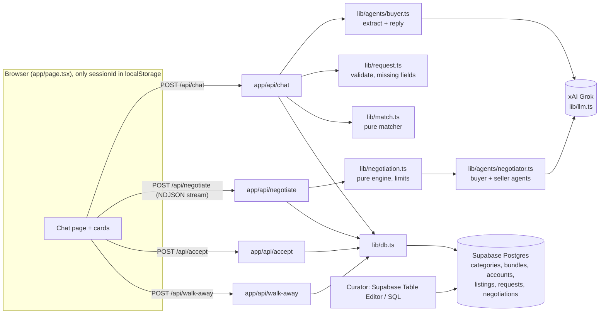

# 00 · Overview: Haggle v2 MVP

## Goal

A public web app where anyone can open a URL, tell their AI buying agent what they want ("black shoes, size 8, ideally Nike Air Max under £100", "I want black sport shoes", "I want to start cycling"), and watch it find listings and **haggle live** with each seller's AI agent inside private limits. The human clicks **Accept deal**. Built in one day by 3 people; deployed on Vercel.

- **Buyers:** anonymous visitors. Each browser gets a random session id; no sign-up.
- **Sellers:** brands (Nike Store, Cycle Hub…) and private sellers (Tom, Anna…), each with a persona and per-listing asking + private floor price. They exist only as DB rows; there is no seller UI.
- **Catalogue:** sellers, listings, categories (with required/optional fields) and bundles all live in Supabase and are edited there directly (07). No marketplace data in code.

## Principles

- **KISS / YAGNI.** If in doubt, leave it out. Four API routes, six tables, one page.
- **Contracts first.** 01 is written in hour 0 and then frozen.
- **Rules in code, data in the DB, words from the LLM.** The LLM extracts structure and writes messages; code decides what's missing, what matches, and what price is allowed.
- **Privacy rule** (01 §6): `floorPrice` only reaches the seller agent; `maxPrice` only reaches the buyer agent and its own visitor. Public views strip them.
- **Live data.** Every request reads Supabase fresh; a DB edit shows up on the next chat message.
- **One haggler per listing.** Negotiate takes a short busy lock on the listing (01 §5); others see it as "Busy" until it's released, sold or expires.
- **No chat history.** Refresh = fresh chat; only the anonymous session id is kept in the browser.

Out of scope: auth/accounts, seller UI, admin UI, payments, shipping, images, Shopify, Tavily, PostHog, multi-item bundle deals (each bundle item is negotiated separately), undoing a sale.

## Stack

| Layer | Choice |
|---|---|
| App | Next.js 16 App Router + TypeScript, npm. **Next 16 has breaking changes; read `node_modules/next/dist/docs` before coding.** |
| UI | Tailwind v4 (shadcn optional, not needed) |
| DB | Supabase Postgres via `@supabase/supabase-js`, server routes only, service-role key, RLS on with no policies |
| LLM | Grok via xAI, `openai` npm package with `baseURL` `https://api.x.ai/v1`; `XAI_MODEL` default `grok-4.7`; temperature 0 for structured steps; JSON validated with Zod 4 |
| Streaming | Plain `fetch` + NDJSON (no Vercel AI SDK) |
| Tests | Vitest, pure functions with fixtures and stubbed agents (no network) |
| Hosting | Vercel (08) |

## Architecture



## Live data (Next.js 16)

- All four routes are `POST` Route Handlers. Next.js never caches non-GET handlers, so they run on every request.
- Don't use `use cache`, `unstable_cache`, module-level memoisation or `globalThis` caches for catalogue data. `loadCatalog()` and `listActiveListingViews()` hit Supabase every call (a few ms; fine at this scale).
- Leave Cache Components (`cacheComponents`) **off** (the default). Don't export `dynamic`/`revalidate`/`fetchCache` from routes (they error if Cache Components is ever turned on, and aren't needed).
- If anyone adds a `GET` handler or a server component that reads the DB, call `await connection()` (from `next/server`) before the read so it's rendered per request, not prerendered at build.
- Confirm against `node_modules/next/dist/docs` (Route Handlers → Caching).

## Repo layout and ownership

```
app/
  layout.tsx, globals.css, page.tsx      C   chat page (06)
  api/chat/route.ts                      B   intake + match (03)
  api/negotiate/route.ts                 B   NDJSON negotiation stream (05)
  api/accept/route.ts                    A   accept a deal, mark listing sold (05)
  api/walk-away/route.ts                 A   walk away, release the listing busy lock (05)
components/                              C   Header, Composer, Bubbles, RequestCard, BundleCard,
                                             StatusLine, MatchList, NegotiationCard, SoldCard (06)
lib/
  schemas.ts                             all Zod schemas + app limits (01, FROZEN)
  db.ts, http.ts                         A   Supabase access, public views, errors (02)
  request.ts                             A   draft → BuyerRequest, missing fields (03)
  match.ts                               A   pure matcher (04)
  llm.ts                                 B   xAI client, completeJSON, completeText (03)
  agents/buyer.ts                        B   extraction + reply prompts (03)
  agents/negotiator.ts                   B   buyer/seller agent prompts (05)
  negotiation.ts                         B   pure engine: applyMove, runNegotiation (05)
  client/session.ts, stream.ts, fixtures.ts   C   session id, NDJSON reader, dev fixtures (06)
supabase/
  schema.sql                             A   (02)
  seed.example.sql                       A   OPTIONAL example data (02)
tests/
  fixtures.ts, match.test.ts,            A   (03, 04, 05)
  request.test.ts, negotiation.test.ts
docs/mvp/                                this spec
vitest.config.ts, .env.example, AGENTS.md, README.md
```

## Workstreams

| | A: Data + matching | B: Agents + negotiation | C: Chat UI + API wiring + deploy |
|---|---|---|---|
| Owns | `supabase/*`, `lib/db.ts`, `lib/http.ts`, `lib/request.ts`, `lib/match.ts`, `app/api/accept`, `app/api/walk-away`, `tests/*` | `lib/llm.ts`, `lib/agents/*`, `lib/negotiation.ts`, `app/api/chat`, `app/api/negotiate` | `app/page.tsx`, `app/layout.tsx`, `app/globals.css`, `components/*`, `lib/client/*`, Vercel project |
| Docs | 02, 04, 07 (+ `request.ts` in 03, tests in 05) | 03, 05 | 06, 08 |

`lib/schemas.ts` is shared and frozen after hour 0; changes need all three to agree.

## Dependency order

```
01 contracts ──┬─> 02 data ──> 04 matching ──┐
               ├─> 03 buyer agent (stubs match until 04) ──┴─> /api/chat complete
               ├─> 05 engine + tests (no LLM) ──> 05 agents ──> /api/negotiate (+ busy lock) ──> /api/accept, /api/walk-away
               └─> 06 UI on fixtures ──> wire /api/chat ──> wire /api/negotiate + /api/accept ──> 08 deploy
07 managing data: any time after 02 (curating real listings runs in parallel all afternoon)
```

## One-day timeline

| Time | A: Data + matching | B: Agents + negotiation | C: UI + deploy |
|---|---|---|---|
| 0:00–1:00 | **Together:** type 01 into `lib/schemas.ts`, agree shapes. A: Supabase project, `schema.sql`, `seed.example.sql`. | Port `lib/llm.ts`, one live `completeJSON` call. | `create-next-app`, theme, empty shell; link Vercel and deploy the empty app. |
| 1:00–3:00 | `db.ts`, `http.ts`, `tests/fixtures.ts`, `request.ts` + tests | `buyer.ts` extract + reply, `/api/chat` with stubbed match | Fixtures, bubbles, composer, `RequestCard`, `BundleCard` |
| 3:00–5:00 | `match.ts` + tests; write `negotiation.test.ts` from 05 | `negotiation.ts` until A's tests pass; negotiator prompts | `MatchList`, `NegotiationCard` on fixture stream, `stream.ts` |
| 5:00–7:00 | `/api/accept`, `/api/walk-away`, busy-lock checks; 07 health checks; start loading real listings | `/api/negotiate` streaming; prompt calibration (05 "Done when") | Wire real routes; accept / walk away / sold; error + cap states |
| 7:00–8:00 | **Together:** end-to-end on localhost, fix the worst bugs. Deploy to production, set env vars, smoke test (08). | | |
| 8:00–9:00 | **Buffer:** stock the catalogue (07), set the xAI spending limit, two-browser test, share the URL. | | |

## Docs

- [01 Contracts](01-contracts.md): schemas, routes, NDJSON events, session + privacy rules (frozen)
- [02 Data](02-data.md): Supabase schema, example seed, `lib/db.ts`
- [03 Buyer agent](03-buyer-agent.md): intake, prompts, `lib/request.ts`, `POST /api/chat`
- [04 Matching](04-matching.md): matcher + tests
- [05 Negotiation](05-negotiation.md): engine, agents, streaming, accept, tests
- [06 UI](06-ui.md): chat page, cards, states, API calls, mocks
- [07 Managing data](07-managing-data.md): editing sellers/listings/categories/bundles live in Supabase
- [08 Deploy](08-deploy.md): Vercel, env vars, public-access design
