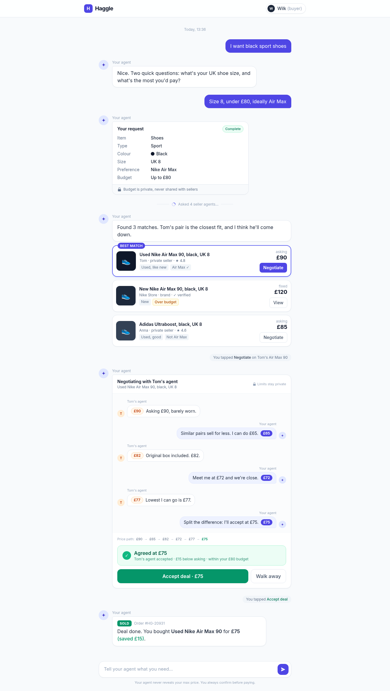
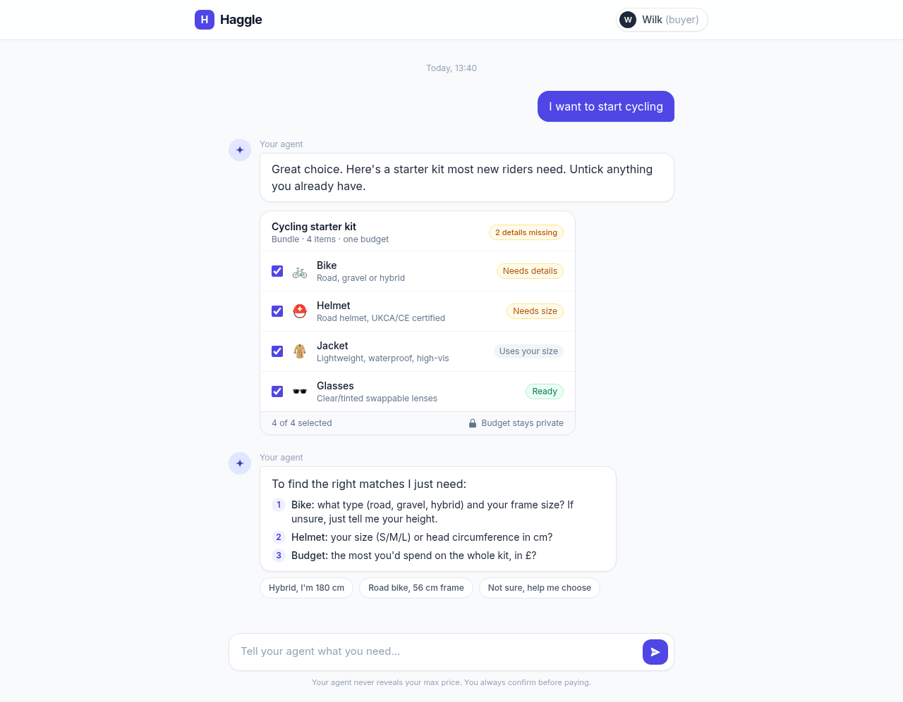

# 06 · UI: the chat page

**Owner:** Workstream C.
**Depends on:** 01 (types, routes, NDJSON events). Build against `lib/client/fixtures.ts` first; wire the real routes when 03/05 land.
**Exposes:** `app/page.tsx`, `app/layout.tsx`, `app/globals.css`, `components/*`, `lib/client/stream.ts`, `lib/client/session.ts`, `lib/client/fixtures.ts` (dev only).

One page. Single centred chat column, input at the bottom, rich cards inline in the conversation. Match the approved mocks; drop the mock's seller ratings, "verified" badges, order number and the "View"/"fixed price" variant (every match card gets **Negotiate**). Quick-reply chips are out (optional stretch, client-side only).

| Shoes flow (single item → matches → negotiation → sold) | Cycling flow (bundle checklist) |
|---|---|
|  |  |

HTML sources: [`mock/shoes.html`](mock/shoes.html), [`mock/cycling.html`](mock/cycling.html). Lift markup and Tailwind classes straight from them.

> The cycling mock's "one budget" subtitle and "most you'd spend on the whole kit" question are superseded: budgets are **per item** (01 §0), asked in each item's line.

## Styling (Tailwind v4)

- `app/globals.css`: `@import "tailwindcss";` plus the mock's palette and font as theme tokens:
  ```css
  @theme {
    --color-brand-50: #eef2ff; --color-brand-100: #e0e7ff; --color-brand-500: #6366f1;
    --color-brand-600: #4f46e5; --color-brand-700: #4338ca;
    --font-sans: var(--font-inter), ui-sans-serif, system-ui, sans-serif;
  }
  ```
- `app/layout.tsx`: Inter via `next/font/google` with `variable: "--font-inter"`; `<body class="bg-slate-50 text-slate-800 font-sans antialiased">`.
- The mocks use the Tailwind v3 CDN. A few utilities were renamed in v4 (e.g. `bg-gradient-to-t` → `bg-linear-to-t`, `shadow-sm` → `shadow-xs`, `outline-none` → `outline-hidden`); check the v4 upgrade guide when something looks off.
- No shadcn needed. No images: where the mock shows an emoji tile, show a neutral tile with the category label's first letter (categories come from the DB and have no icon field).

## Client helpers

```ts
// lib/client/session.ts
export function getSessionId(): string;   // localStorage "haggle.sessionId" ?? crypto.randomUUID() (saved). Sent in every request body.
                                          // The ONLY thing the app stores in the browser.

// lib/client/stream.ts  (port of the previous repo's helper)
export async function readNdjson<T>(res: Response, onEvent: (e: T) => void): Promise<void>;
  // res.body.getReader() + TextDecoder({stream:true}); split buffer on "\n"; JSON.parse each non-empty line;
  // parse any remainder when done (last line may lack "\n").

// lib/client/fixtures.ts  (dev only)
export const fixtureChatResponses: ChatResponse[];   // the shoes turns + a cycling first turn, shaped exactly like 01 §3
export const fixtureNegotiationLines: string[];      // the NDJSON example in 01 §4
```

## Page state (`app/page.tsx`, `"use client"`)

```ts
type Entry =
  | { kind: "user"; text: string }
  | { kind: "agent"; text: string; error?: boolean }
  | { kind: "request" }                                  // one per chat; renders the LATEST request state (live)
  | { kind: "status"; sellersAsked: number }
  | { kind: "matches"; matches: ItemMatches[] }
  | { kind: "note"; text: string }                       // "You tapped Negotiate on Tom's Used Nike Air Max 90…"
  | { kind: "negotiation"; key: string; category: string; listing: ListingView; negotiationId: string | null;
      turns: Offer[]; status: "running" | "agreed" | "failed" | "error"; finalPrice: number | null;
      reason: EndReason | null; error?: string; decision: null | "accepted" | "walked" }
  | { kind: "sold"; title: string; price: number; saved: number };

type ChatState = {
  entries: Entry[];
  messages: ChatMessage[];        // text-only history sent to /api/chat (user + agent replies)
  requestId: string | null;
  request: BuyerRequest | null;   // latest
  missing: MissingItem[];
  catalog: ChatResponse["catalog"] | null;
  excluded: string[];             // unticked bundle rows
  soldIds: string[];              // listings we learned are sold (our own accept, or 409 "Listing sold")
  busyIds: string[];              // listings we learned are busy (409 "Listing busy"), on top of MatchCard.busy
  pending: boolean;               // /api/chat in flight
}
```

**No chat history.** State lives only in React memory. A refresh starts a fresh, empty chat; **New chat** is a plain reset of this state. The only thing in `localStorage` is the `sessionId` (kept across refreshes and New chat, so per-session caps and lock ownership still work). The server stores no transcript either: `messages` travels in each `/api/chat` body.

## Flows and API calls

### Send a message → `POST /api/chat`

1. Push `{kind:"user"}`, append to `messages`, set `pending` (show a "Your agent is typing…" bubble).
2. Body: `{ sessionId, requestId, messages, excluded }`.
3. On `200 ChatResponse`: store `requestId`, `request`, `missing`, `catalog`; set `excluded` = categories of items with `included:false`; append the agent reply to `messages`. Push entries in this order:
   ```
   firstCard = no "request" entry yet && request.items.length > 0
   if firstCard && matches      → push {request}
   if matches                   → push {status, sellersAsked}
   push {agent, reply}
   if firstCard && !matches     → push {request}
   if matches                   → push {matches}
   ```
   (Shoes: the card appears under the first question and flips to "Complete" on the next turn; cycling: intro text then the checklist; matches always come as status line → reply → cards, like the mock.)
4. Errors: 400/429 → agent bubble with the server's `error` text (e.g. "This chat is full, start a new one", then disable the input); 5xx/502 → "Something went wrong, try again." with the user's text restored into the input.
5. Input: `maxLength={MAX_MESSAGE_CHARS}`, disabled while `pending` or when `messages.length >= MAX_MESSAGES`.

### Negotiate → `POST /api/negotiate` (stream)

1. **One negotiation at a time, user-initiated.** A negotiation starts only when the user taps **Negotiate** on a card. While any card is `running`, every Negotiate button is disabled. Also disabled for listings in `soldIds`. Busy listings keep the button enabled (the lock may be free by now). Once a run ends (agreed/failed/error), the user may negotiate another listing.
2. Push `{note: "You tapped Negotiate on {sellerName}'s {title}"}` and a `{negotiation, status:"running", turns:[]}` entry.
3. `fetch("/api/negotiate", { method: "POST", body: { sessionId, requestId, category, listingId } })`.
   - Non-200: read `{ error }`, set card `status:"error"`, show it:
     - 409 "Listing busy" → **"Someone is haggling for this one, try again shortly"** (+ **Try again**); add to `busyIds` so the match card shows "Busy".
     - 409 "Listing sold" → "This one has just been sold"; add to `soldIds`.
     - 429 → "You've hit the negotiation limit for this session".
   - 200: `readNdjson<NegotiationEvent>`: `start` → set `negotiationId` · `turn` → append `offer` · `end` → set `status`, `finalPrice`, `reason` · `error` → `status:"error"`.
4. Auto-scroll to the bottom on each new turn.

### Accept → `POST /api/accept`

1. Body `{ sessionId, negotiationId }`. Button shows a spinner.
2. `200 AcceptResponse` → card `decision:"accepted"`, push `{note: "You tapped Accept deal"}` and `{sold, title, price: finalPrice, saved: askingPrice − finalPrice}`; add listing to `soldIds`.
3. `409` "Deal expired" (the visitor waited past the 2-minute hold and someone else started haggling) → the result box shows "This deal expired. Try negotiating again shortly." instead of the buttons.

### Walk away → `POST /api/walk-away`

Body `{ sessionId, negotiationId }` (fire and forget; ignore errors). Card `decision:"walked"`, buttons hidden, push `{note: "You walked away"}`. The server releases the listing lock so others can haggle for it straight away.

## Components (`components/`)

| Component | Renders | Notes |
|---|---|---|
| `Header` | Logo tile "H" + "Haggle"; right: pill with avatar "Y" + **"You (buyer)"**; small "New chat" text button | sticky, `max-w-3xl` like the mock |
| `Composer` | Input "Tell your agent what you need..." + send button; footnote "Your agent never reveals your max price. You always confirm before paying." | sticky bottom with the mock's gradient; Enter submits |
| `UserBubble` / `AgentBubble` / `Note` | Right brand bubble / left white bubble with ✦ avatar and "Your agent" label / small grey centred-right pill | agent text: `whitespace-pre-line` (numbered lists render as lines) |
| `RequestCard` | Single-item request: title "Your request", badge **Complete** (green, `status:"ready"`) or **Missing: size, budget** (amber); rows Item (category label), each required field, filled optional fields, Preference, Budget ("Up to £80" / "—"); footer 🔒 "Budget is private, never shared with sellers" | field labels humanised from keys (`frame_size` → "Frame size", `maxPrice` → "Budget"); values capitalised; colour dot if the value is a valid CSS colour (optional) |
| `BundleCard` | Used instead of `RequestCard` when `request.bundle` is set: title = bundle label, subtitle "Bundle · N items", badge **"N details missing"** (amber) or **Ready**; one row per item: checkbox, letter tile, category label, subtitle (filled fields + "up to £X" joined " · ", else "Needs: type, frame size, budget"), chip **Ready** / **Needs {field}** (1 missing; `maxPrice` shows as "budget") / **Needs details** (2+) / **Skipped** (unticked); footer "X of N selected", 🔒 "Budget stays private" | each item has its own budget (no kit budget); the badge counts all missing fields of ticked items, `maxPrice` included. Toggling a checkbox updates `excluded` locally (sent with the next message). Checkboxes disabled while `pending` or once `status:"ready"` |
| `StatusLine` | Centred divider: "Asked {sellersAsked} seller agents..." | spinner icon as in mock; static is fine |
| `MatchList` + `MatchCard` | Per `ItemMatches`: for bundles a small heading with the category label; cards; empty group → "No matches for {label} right now." Card: first card has **Best match** badge + brand border; title; "{sellerName} · private seller" / "· brand"; chips: condition ("Used"/"New") if present, each preference "Air Max ✓" if in `matchedPreferences` else "Not Air Max", **Over budget** (amber) if `overBudget`, **Busy** (slate, tooltip "Someone is haggling for this one") if `busy` or in `busyIds`; right: "asking", **£price**, **Negotiate** (primary on best, outline on others) | Negotiate disabled per the rules above (busy stays tappable); sold listings show "Sold" instead |
| `NegotiationCard` | Header "Negotiating with {sellerName}'s agent" + listing title, right 🔒 "Limits stay private"; bubbles: seller left (orange initial avatar, "{sellerName}'s agent", orange price chip) / buyer right (brand chip, "Your agent"); `accept` turns show the chip with ✓; typing dots on the next side while `running`; "Price path: £90 → £68 → … → **£74**" (final in green; append `finalPrice` if it differs from the last turn, e.g. midpoint) | result box below, see states |
| `SoldCard` | Agent bubble with **SOLD** badge: "Deal done. You bought **{title}** for **£X** (saved £Y)." | no order number |

### NegotiationCard states

| State | Shows |
|---|---|
| `running` | bubbles as they stream + typing dots |
| `agreed`, no decision | green box "✓ Agreed at £X"; subline = reason text ("{sellerName}'s agent accepted" / "Your agent accepted" / "Offers met" / "Split the difference") + " · £{asking − X} below asking · within your £{maxPrice} budget" (maxPrice from the request item); buttons **Accept deal · £X** (green, full width) and **Walk away**; small note "Held for you for 2 minutes" |
| `agreed` + `accepted` | green box, no buttons (Sold card follows) |
| `agreed` + `walked` | green box greyed, "You walked away" |
| `failed` | slate/amber box "No deal. Couldn't meet within your budget in 6 turns." Other listings stay negotiable |
| `error` | "Negotiation interrupted" (or the server's error text) + **Try again** (starts a fresh negotiation) |

## Build steps

1. Hour 0–1: `npx create-next-app@latest` (TypeScript, Tailwind, App Router, npm), theme tokens, Inter, `Header` + `Composer` + empty column. Read `node_modules/next/dist/docs` first (Next 16).
2. Write `lib/client/fixtures.ts` from the examples in 01; render every entry kind from fixtures (a `?fixtures=1` switch or a const is fine; remove before deploy).
3. Build `RequestCard`, `BundleCard`, `MatchList`, `NegotiationCard` (feed fixture NDJSON lines through a fake `Response` to exercise `readNdjson` with delays), `SoldCard`.
4. Wire `POST /api/chat`, then `/api/negotiate`, then `/api/accept` and `/api/walk-away`, as each lands.
5. Polish: auto-scroll, disabled states, error bubbles, mobile width (column is `max-w-2xl`, works on a phone).

## Done when

- [ ] Side by side with the mock screenshots, the shoes and cycling flows look the same (minus dropped extras).
- [ ] Full shoes flow works against the real API: question → live request card → status line + 3 match cards (best match, over-budget tag) → streamed negotiation → Agreed → Accept → Sold.
- [ ] Cycling flow: checklist card with per-item chips; unticking an item updates the card and is excluded on the next message; matches grouped per item.
- [ ] Failed negotiation, walk away, 409 "Listing busy" (two browsers: while one haggles, the other taps Negotiate on the same listing and sees "Someone is haggling for this one, try again shortly"), "Deal expired" and 429 limit all render sensibly.
- [ ] Refresh starts a fresh chat (only `haggle.sessionId` in localStorage); New chat resets; only one negotiation can run at a time.
- [ ] The browser never calls Supabase; no Supabase or xAI key in the client bundle (`grep -r SUPABASE .next/static` finds nothing).
- [ ] Works on a phone-width screen.
